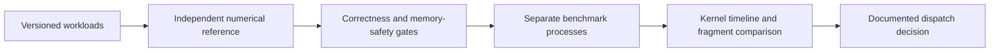

# GEMM Lab Qualification

[](https://github.com/JDinSeattle/gemm-lab-qualification/actions/workflows/ci.yml)

A reproducible GPU performance-engineering study of small-batch linear projections: numerical boundaries, native build qualification, measurement provenance, and whether kernel behavior survives model-fragment integration.

**The result is a decision, not a leaderboard.** Split-K substantially improves the inherited unsplit PTX kernel on decode shapes, but the current measurements do not establish a cuBLASLt win. The repository retains slower cases, unsupported CUTLASS layouts, and failed environment attempts. [Measured results and raw evidence](docs/RESULTS.md).

## Reproduce

On Linux with a supported NVIDIA GPU, CUDA toolkit/Compute Sanitizer/Nsight Systems, CMake, Ninja, Git and [uv](https://docs.astral.sh/uv/):

```bash
bash scripts/reproduce.sh
```

This installs locked Python dependencies in `/tmp/gemm-lab-qualification-venv` and a separate CUTLASS 4.6.1 environment. The default native architecture is sm_89; use `CUDA_ARCH` for another build, which still requires new qualification. Run directories are immutable and printed at completion. Generate the readable report with:

```bash
python scripts/summarize.py results/<run-directory>
```

For existing matching environments, set `LAB_PYTHON` and `CUTE_PYTHON`. CPU-only checks: `python scripts/run.py --cpu-only` after installing PyTorch, NumPy and pytest. CPU CI does not assert GPU success.

## What is implemented

- FP64 full-output oracle with scalar cross-checks, a versioned manifest, 76 GPU comparisons, strided fallback, empty dimensions, poisoned storage and mutation tests.
- Native CUDA/PTX/WMMA/Split-K plus cuBLASLt; 86 native CTest cases. Reused kernels are explicitly attributed to the pinned original GEMM Lab.
- Triton matmul and fused bias/SiLU, and a separately pinned, rebuilt CUTLASS CuTe adapter.
- Correctness gates bound to source digests, package versions, GPU identity and driver; failed gates prevent timing.
- Raw CUDA events, shuffled execution, allocation/transfer and host-to-host timings, Compute Sanitizer logs, and Nsight CUDA timelines.



Read the [contract](docs/contract.md), [registered hypotheses](docs/hypotheses.md), [results](docs/RESULTS.md), and [interview evidence](docs/INTERVIEW.md). Hardware counters are restricted on this host; the report distinguishes actual CUDA timeline evidence from unconfirmed occupancy/bandwidth hypotheses. No serving-scale or cross-architecture performance claim is made.

License: MIT for this lab; inherited source attribution is in [provenance](manifests/provenance.json) and [upstream license](LICENSE.upstream). CUTLASS is downloaded separately under its own license. Historical performance records are not reused as current evidence.
